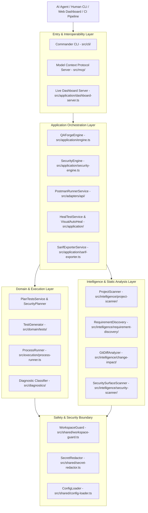
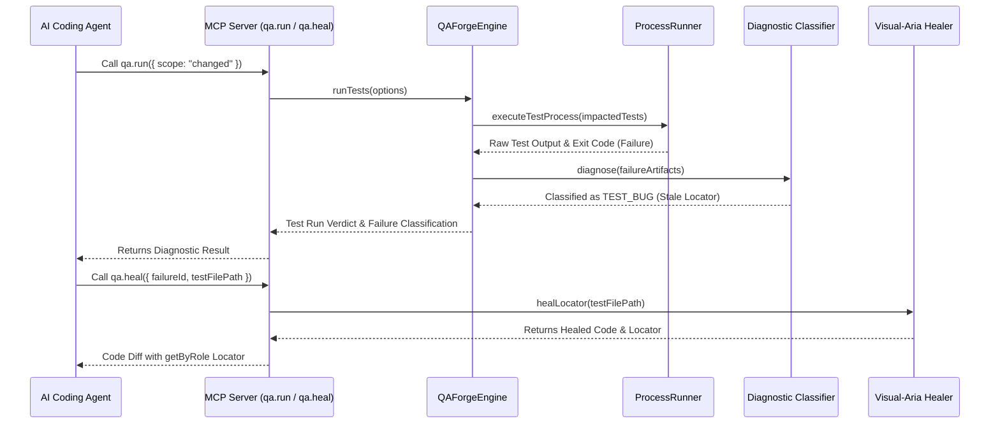
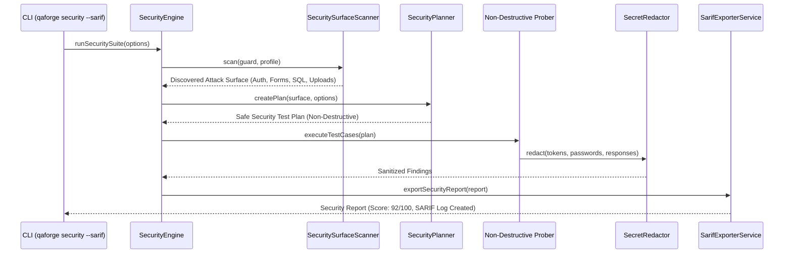

# 04_ARCHITECTURE_RUNTIME_MAP.md — Architectural & Runtime Map

This document outlines the layered architecture, component boundaries, execution flows, and cross-cutting systems.

---

## 1. High-Level Layered Architecture

---

## 2. Core Execution Flows

### A. Autonomous Testing & Healing Loop

### B. Security Discovery, Probing & SARIF Export Flow

---

## 3. Cross-Cutting Safety & Sandboxing Systems

1. **`WorkspaceGuard` (`src/shared/workspace-guard.ts`)**:
   - Enforces path containment within project boundaries.
   - Blocks path traversal attacks (`../../../etc/passwd` or `C:\Windows\System32`).
2. **`SecretRedactor` (`src/shared/secret-redactor.ts`)**:
   - Intercepts all stdout, stderr, and JSON payloads to prevent leaking sensitive API keys, JWTs, and session cookies.
3. **Safe Security Mode (`safeMode: true`)**:
   - Built into `SecurityEngine` and `ConfigLoader` to guarantee non-destructive probe behavior in staging/test environments.
