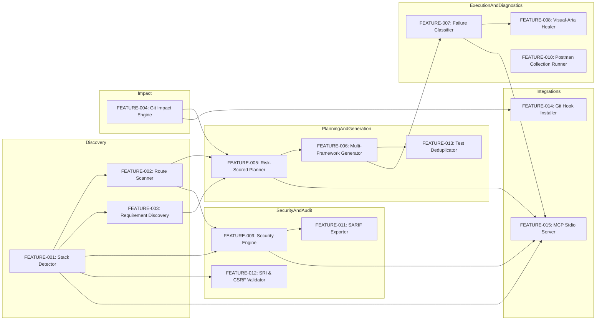

# 05_FEATURE_DEPENDENCY_GRAPH.md — Subsystem & Feature Dependency Graph

This document maps the inter-feature dependencies, data flows, and prerequisite relationships across QAForge.

---

## 1. Subsystem Dependency Graph

---

## 2. Feature Prerequisite & Dependency Table

| Target Feature | Direct Prerequisites | Shared Data Structures | Upstream Failure Effect |
| :--- | :--- | :--- | :--- |
| **`FEATURE-002` (Route Scanner)** | `FEATURE-001` (Stack Detector) | `ProjectProfile` | Defaults to empty routes; falls back to manual test paths. |
| **`FEATURE-003` (Requirement Discovery)**| `FEATURE-001`, `FEATURE-002` | `ProjectProfile`, `DiscoveredRequirement` | Generates basic synthetic requirements from route paths. |
| **`FEATURE-004` (Change Impact)** | Git repo initialized | `ImpactAnalysisResult` | Falls back to running full test suite (`scope: "all"`). |
| **`FEATURE-005` (Test Planner)** | `FEATURE-003`, `FEATURE-004` | `TestPlan`, `RiskScore` | Generates flat unweighted test plan. |
| **`FEATURE-006` (Test Generator)** | `FEATURE-005` | `TestPlan`, `GeneratedTestFile` | Blocked if test plan generation fails. |
| **`FEATURE-007` (Diagnostics)** | Test execution output | `DiagnosticResult`, `FailureArtifact` | Defaults to generic `TEST_BUG` classification. |
| **`FEATURE-008` (Visual Healer)** | `FEATURE-007` (`TEST_BUG`) | `DOMSnapshot`, `HealResult` | Cannot heal if failure is `APPLICATION_BUG`. |
| **`FEATURE-009` (Security Engine)** | `FEATURE-001`, `FEATURE-002` | `SecurityAttackSurface`, `SecurityReport` | Probes default URL if routes not auto-discovered. |
| **`FEATURE-011` (SARIF Exporter)** | `FEATURE-009` (Security Engine) | `SecurityReport`, `SarifLog` | Outputs empty SARIF log if no security findings exist. |
| **`FEATURE-015` (MCP Server)** | All Core Services | JSON-RPC Schemas | Stdio server boots independently; tools fail gracefully on error. |
